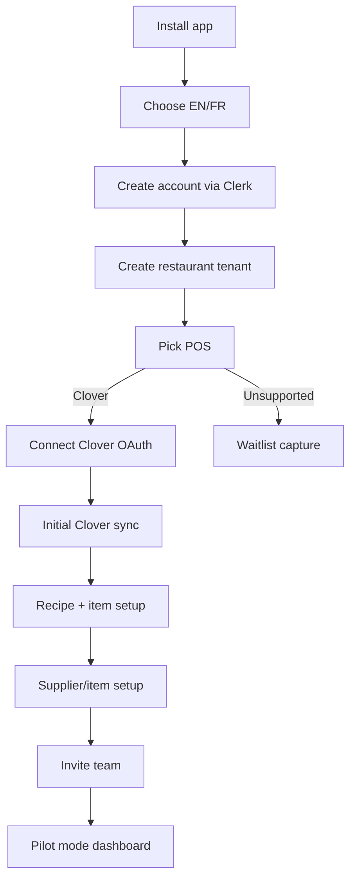
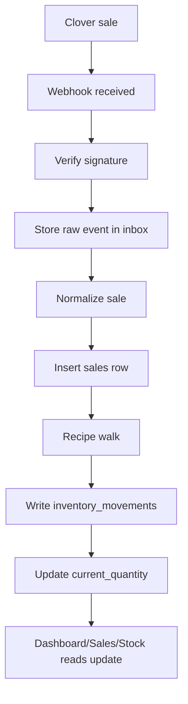
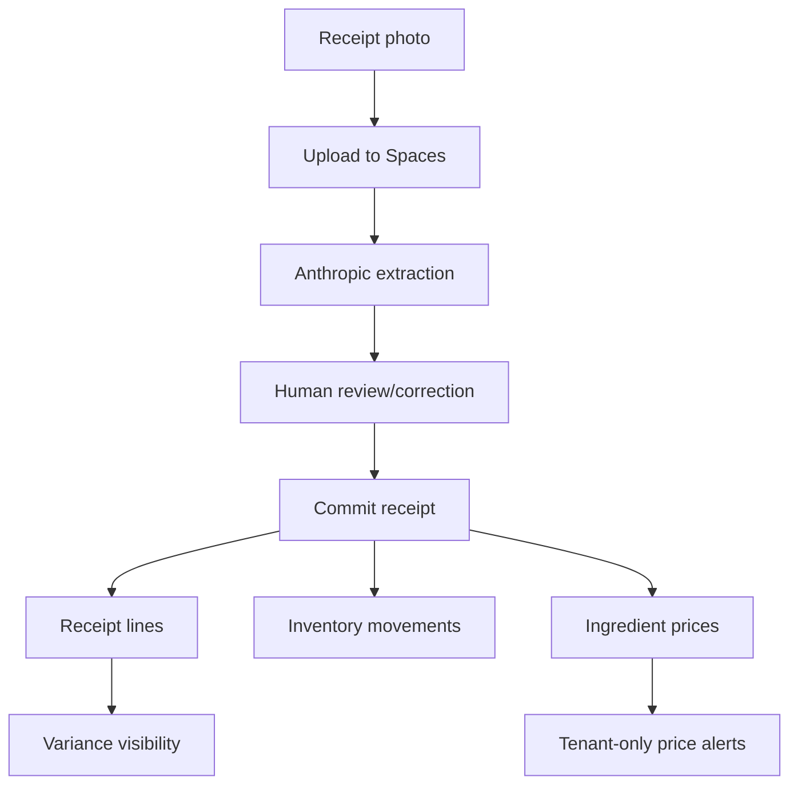
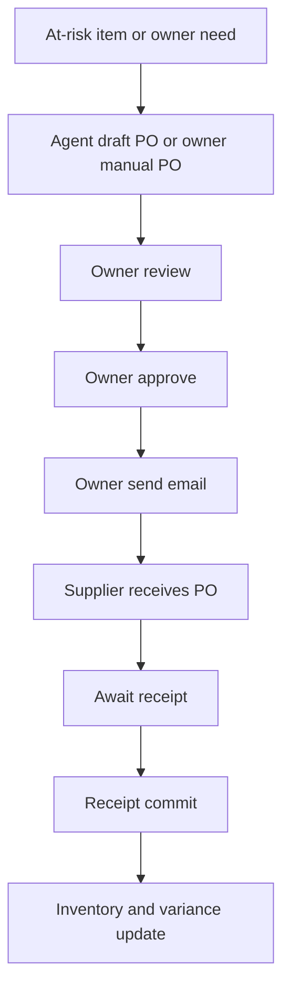
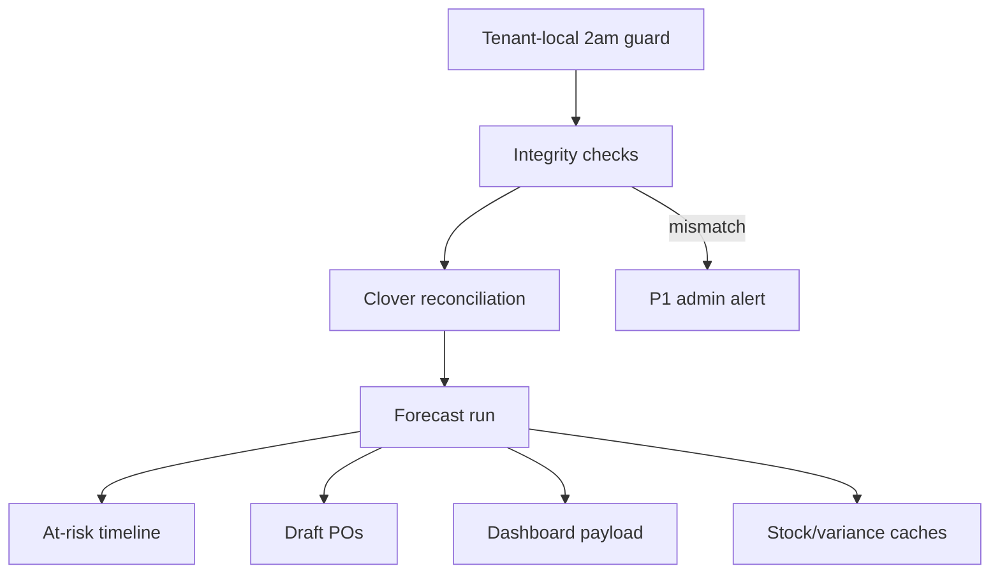
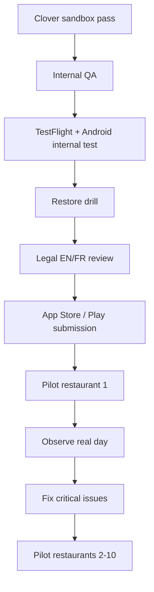

# ReorderOS Architecture Workflow Map

This map shows the v1 workflows that must work before real restaurant launch.

## Customer Activation

Hard gates:

- Unsupported POS cannot proceed to live dashboard.
- Billing hidden in pilot.
- App language can switch EN/FR.
- Staff/Manager accounts are individual accounts.

## Daily Sales To Inventory Loop

Hard gates:

- Duplicate webhook does not duplicate inventory movement.
- Failed worker can retry safely.
- No LLM in sale depletion.

## Receiving And Price Capture

Hard gates:

- Anthropic result is never auto-committed.
- Failed extraction allows manual receipt entry.
- Price rows are tenant-only in v1.

## Purchase Order Flow

Hard gates:

- Owner-only manual PO.
- Owner-only approval.
- Owner-only send.
- Email-only in v1.

## Nightly Agent

Hard gates:

- Runs once per tenant per local date.
- Forecast math deterministic.
- Draft PO generation is not synchronous.
- Integrity mismatch freezes automation, not owner operations.

## Pilot Launch Workflow

Hard gates:

- No pilot before restore drill.
- No cross-tenant price comparison in pilot.
- Pilot pricing cap: first 10 restaurants.

