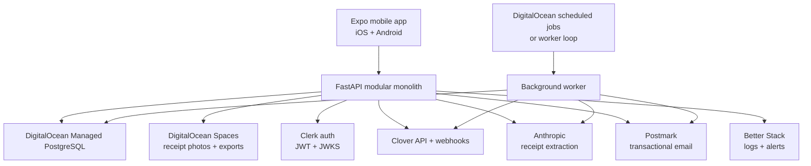
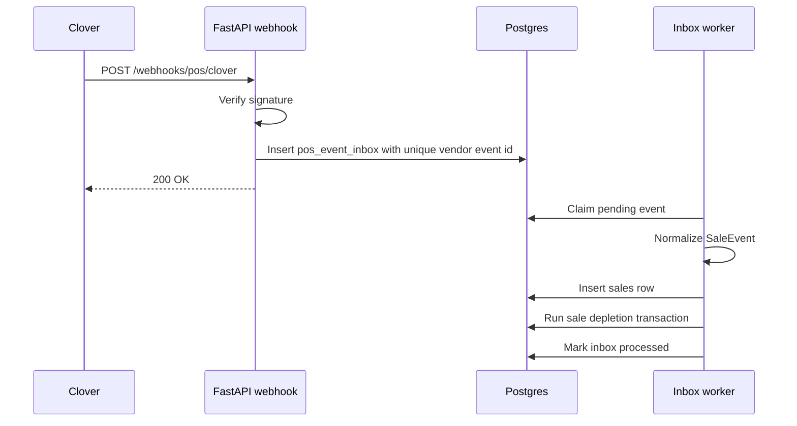
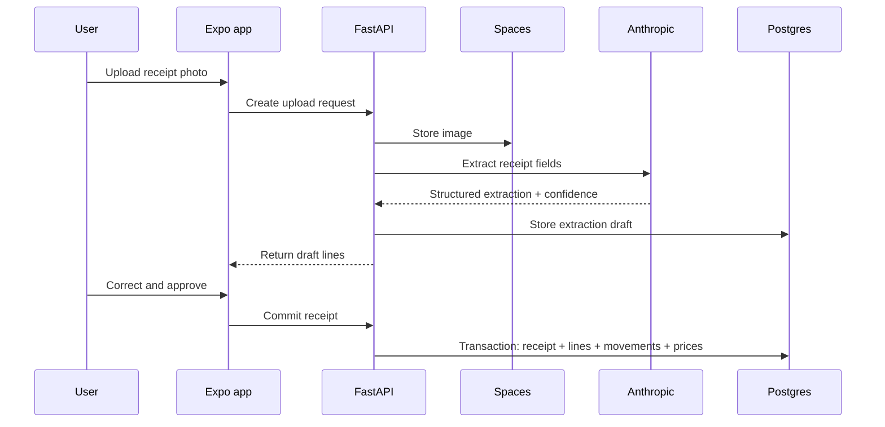
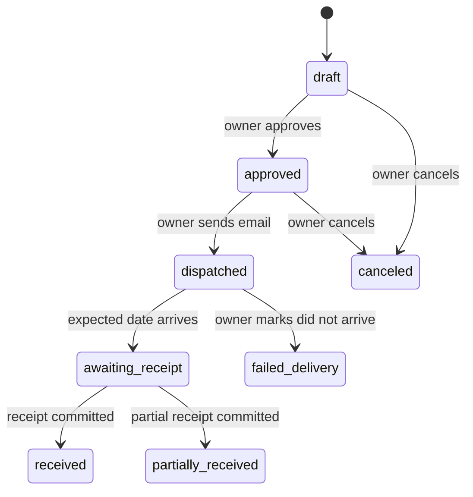
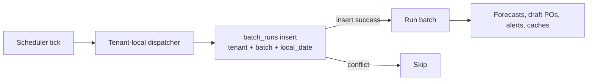

# ReorderOS V1 System Design

## System Posture

ReorderOS v1 should be a modular monolith, not microservices.

One deployable FastAPI backend owns:

- auth and tenant context
- Clover integration
- inventory ledger
- receipt extraction
- purchase orders
- forecasting batch
- dashboard/sales/stock/settings APIs
- outbox side effects

Modules are separated in code, but deployed together. This keeps operations realistic for a solo founder while preserving clean boundaries.

## High-Level Architecture



## Backend Module Boundaries

```text
app/
  main.py
  core/
    config.py
    logging.py
    security.py
    database.py
    rls.py
    idempotency.py
  modules/
    auth/
    tenants/
    users/
    rbac/
    pos_clover/
    inventory/
    recipes/
    sales/
    receipts/
    purchase_orders/
    forecasting/
    dashboard/
    stock/
    settings/
    exports/
    notifications/
    outbox/
    observability/
```

Rule: modules may depend inward on `core`, but should not reach across each other through database writes. Cross-module writes go through service functions with explicit transaction boundaries.

## Data Safety Model

### Tenant Isolation

- Every tenant-scoped table has `tenant_id`.
- RLS is enabled on every tenant-scoped table.
- Middleware validates Clerk JWT and sets `app.tenant_id`.
- Owner/Manager/Staff role is set as `app.user_role`.
- Missing tenant context returns zero rows.

### Append-Only Truth

Append-only tables:

- `inventory_movements`
- `admin_audit_log`
- `ingredient_prices`
- `pos_event_inbox`
- `outbox_events`
- `batch_runs`

Mutable materialized state:

- `inventory_items.current_quantity`
- dashboard payloads
- cache tables
- POS connection status

Rule: mutable state exists for read speed. Append-only rows exist for truth.

## Clover Webhook Reliability

Use durable inbox processing.



Why this matters:

- Clover receives a fast response.
- Duplicate deliveries are harmless.
- Processing can retry without losing the raw event.
- Expensive recipe walking is not inside the vendor request.

## Receipt Photo Extraction



Hard rule: Anthropic output is a draft, never committed without human review.

## Purchase Order Flow



V1 constraints:

- Manual PO creation is owner-only.
- Approval is owner-only.
- Sending is owner-only.
- Send channel is email-only.
- SMS is deferred.

## Batch Model

Batch jobs:

- nightly forecast
- Clover reconciliation
- inventory integrity check
- price integrity check
- backup/restore drill hooks
- export generation

Use `batch_runs` for exactly-once-per-tenant-local-day guard.



## Failure Handling Matrix

| Failure | User impact | Backend behavior | Owner/operator response |
| --- | --- | --- | --- |
| Clover webhook delayed | Inventory stale briefly | reconciliation backfills | show stale POS banner after threshold |
| Clover API down | Sales import pauses | retry and circuit break | continue app with stale labels |
| Anthropic down | receipt photo extraction blocked | return manual-entry fallback | user enters receipt manually |
| Postmark down | PO email delayed | outbox retry, dead-letter alert | owner sees send failure |
| Clerk down | new login/invite blocked | cached JWTs continue until expiry | existing sessions degraded |
| Stripe down | billing hidden in pilot | no customer block | defer billing action |
| Postgres degraded | product impacted | alert P1, restore path | execute runbook |

## Production Readiness Gates

Before first pilot restaurant:

- Clover sandbox end-to-end pass.
- RLS bypass test pass.
- Receipt extraction manual-review pass.
- PO email send pass.
- Restore drill pass.
- EN/FR legal and UI string review pass.
- App Store/TestFlight build pass.
- Google Android build pass.
- P1 alert route tested.

